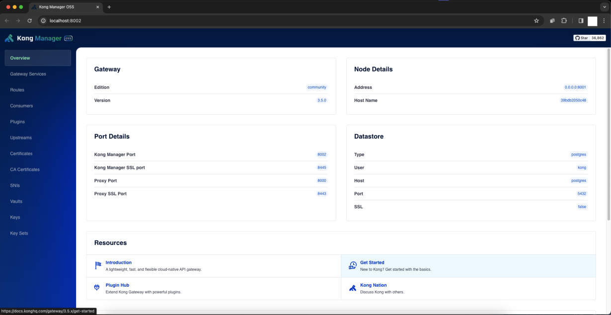

# sample-kong-gateway

Esta é uma aplicação de exemplo para demonstrar o uso do Kong Gateway como API Gateway, usando o Docker Compose para subir os serviços.

## Pré-requisitos
1. Docker
2. Docker Compose
3. Git

## Como executar
> Na primeira execução, descomentar a linha 10 do arquivo `compose.yml` para realizar o **kong migrations**.
> Após a primeira execução, comentar a linha 10 novamente para evitar que o **kong migrations** seja executado novamente.

1. Clone o repositório
2. Execute o comando `docker compose up` na raiz do projeto
3. Acompanhe os logs até que o Kong Gateway tenha concluído o processo de migration
4. Pressione `Ctrl+C` para parar a execução
5. Comente a linha 10 do arquivo `compose.yml`
6. Execute o comando `docker compose up -d` para executar os serviços em background
7. Acesse o Kong Dashboard em http://localhost:8002

